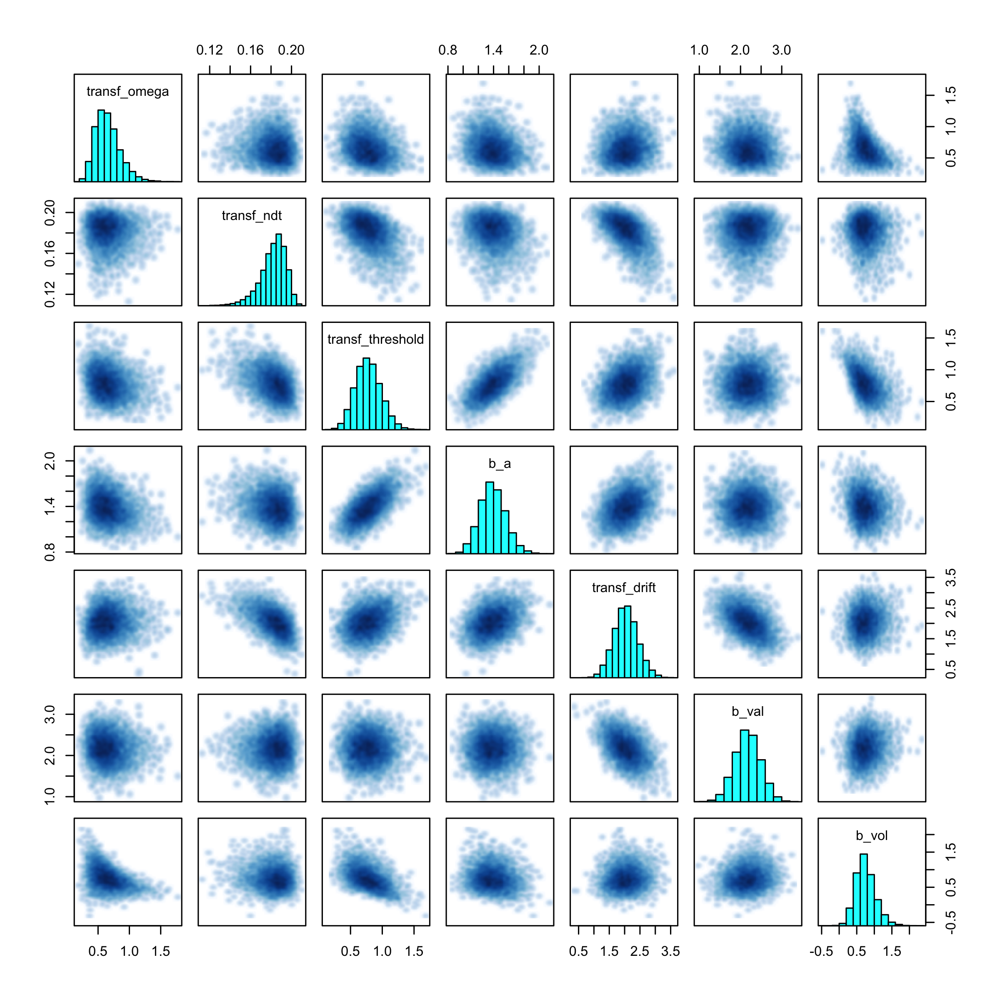

Volatile Kalman Filter + Racing Diffusion Model
================

``` r
# Packages -----------------
ipak = function(pkg) {
    new.pkg = pkg[!(pkg %in% installed.packages()[, "Package"])]
    if (length(new.pkg))
        install.packages(new.pkg, dependencies = T)
    sapply(pkg, require, character.only = T)
}
packages = c( "readr", "tidyverse", "ggplot2", 
              "patchwork", "rstan", "bayesplot")
ipak(packages)

# Functions --------------- 
# check path!
sapply(list.files(pattern="[.]R$", path="~/Desktop/R/PAM_MC/utl", full.names=TRUE), source)
```

### NB

We are still working on the recovery of VKF’s parameters (lambda and
v0). For now, lambda = 0.1 and v0 = omega.

## 1. Create or load trial list

``` r
# u = c(rbinom(50,size = 1, .8), rbinom(50,size = 1, .2),
#      rbinom(20,size = 1, .8), rbinom(20,size = 1, .2),
#      rbinom(20,size = 1, .8), rbinom(20,size = 1, .2))
# write_rds(u, file = "u.rds")
u = read_rds("demo/u.rds")
```

## 2. Simulation

### 2.1. Perceptual Model - Volatile Kalman Filter

Set VKF parameters’ values and extract trajectories

``` r
lambda = .1 # volatility learning rate -> fixed in model file: vkf_fixed_rdm.stan
omega = .5 # tonic volatility --> estimated
v0 = omega # initial volatility = omega!
signals = vkf_bin(u, lambda, v0, omega) # extract all signals

# Visualize
muhat_p = signals%>%ggplot(aes(y = 1/(1+exp(-predictions)), 
                     x = 1:nrow(signals)))+
  geom_line(color = "cyan4")+ #trial-by-trial beliefs
  geom_point(aes(y = u))+ 
  #geom_line(aes(y = volatility),color = "purple")+ #trial-by-trial volatility
  theme_classic()+ylab("muhat")+xlab("trial")

vol_p = signals%>%ggplot(aes(y = volatility, 
                     x = 1:nrow(signals)))+
  geom_line(color = "purple")+ #trial-by-trial volatility
  theme_classic()+ylab("volatility")+xlab("trial")
muhat_p/vol_p
```


### 2.2. Response Model - Racing Diffusion Model

``` r
# extract trajectories from VKF
muhat = 1/(1+exp(-signals$predictions)) # sigmoid
vol = signals$volatility

# Set values for simulation
# RDM 
a_a = 1 # intercept of decision threshold "a"
b_a = 1.5 # Muhat effect for "a"
b_vol = 1 # Volatility effect for "a"
a_v = 2.5 # Intercept of drift rate "v"
b_val = 2 # Effect of validity (resp = input) on the drift
Ter = .150 # Non decision time

# Calculate trial-wise threshold for both the accumulators
a_c1 = a_a + b_a*(.5-muhat) + b_vol*vol
a_c0 = a_a + b_a*(.5-(1-muhat)) + b_vol*vol

# Calculate drift rate for both accumulators
drift_c1 = a_v + b_val*(u==1) 
drift_c0 = a_v + b_val*(u==0) 

# Simulate rt and choice
rt = rep(NA,length(u)); resp = rep(NA,length(u)) #init rt and resp

for (n in 1:length(u)){ #looping over the trial list
    probs_1 =    RDM_pdf(seq(0.01,3,0.01),drift_c1[n],a_c1[n])
    P1 = sample(x = seq(0.01,3,0.01), 1,probs_1,replace = TRUE)
    probs_2 =    RDM_pdf(seq(0.01,3,0.01),drift_c0[n],a_c0[n])
    P2 = sample(x = seq(0.01,3,0.01), 1,probs_2,replace = TRUE)
    P = c(P1,P2)
    rt[n] = as.numeric(min(P))
    resp[n] = ifelse(as.numeric(P1) < as.numeric(P2), "1","2")
    rt[n] = rt[n]+Ter
}


dat = data.frame(rt = rt, resp01 = ifelse(resp==2,0,1), resp = resp, muhat = muhat, stim = u,
                 trial = 1:length(rt))%>%mutate(accuracy = ifelse(resp01 == stim,1,0))

p_resp = dat%>%ggplot(aes(y = muhat, x = trial))+
    geom_line()+
    geom_point(aes(y =resp01, color = as.factor(resp01)))+
    ylab("muhat")+scale_color_manual(values = c("orange","purple"))+
    theme_classic()

p_rt = dat%>%ggplot(aes(y = rt, x = trial, color = as.factor(accuracy)))+
    geom_point(alpha = .7)+
    ylab("reaction times")+scale_color_manual(values = c("red","green3"))+
    theme_classic()

p_resp/p_rt
```


## 3. Recovery

### 3.1. Fit model to simulated data

``` r
dat_mod = list(N = nrow(dat),
               choice = as.integer(resp),
               stim_1 = ifelse(u == 1,1,0),
               stim_2 = ifelse(u == 0,1,0),
               rt = dat$rt)

nchain = 3;ncore = nchain; niter = 6000;

fit = stan(
    file = "~/Desktop/R/PAM_MC/stan_models/vkf_fixed_rdm.stan",#check path!!
    data = dat_mod, chains = nchain, cores = ncore,
    iter = niter, warmup = niter/2, init = .1)

post = as.data.frame(fit)
df_check = data.frame(omega=post$transf_omega,
                      Ter=post$transf_ndt,
                      a_a=post$transf_threshold,
                      b_a=post$b_a,
                      a_v=post$transf_drift,
                      b_val=post$b_val,
                      b_vol = post$b_vol)
```

### 3.2. Plot true vs estimated

``` r
mcmc_recover_hist(
    x = df_check[1:7],
    true = c(omega,Ter,a_a,b_a,a_v,b_val,b_vol) # set true values
)+theme_classic()
```


### 3.3. Check sampling

``` r
pairs(fit, pars = c("transf_omega",
                    "transf_ndt","transf_threshold","b_a",
                    "transf_drift","b_val", "b_vol"))
```

<!-- -->
